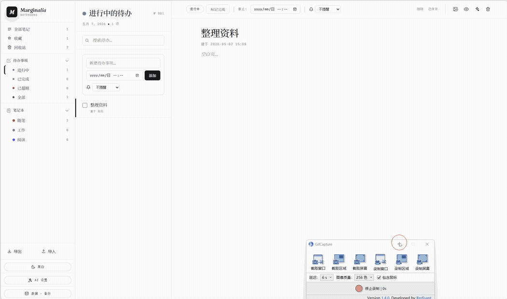

<div align="center">

# 📝 Marginote

**本地优先 · Markdown 笔记 · 待办提醒 · AI 优化 · Chrome 扩展 / Windows 桌面版**

[](./LICENSE)
[](https://developer.chrome.com/docs/extensions/mv3/intro/)
[](./extension/manifest.json)
[](https://www.google.com/chrome/)
[](https://www.microsoft.com/edge)
[](https://github.com/Joeklepko/marginote/releases)

*Marginote — 面向 Windows 与本地 Agent 的 AI 原生个人笔记库，浏览器扩展保持兼容*

[功能](#-核心功能) · [安装](#-安装) · [截图](#-截图) · [AI 配置](#-ai-提供商) · [隐私](#-隐私与数据) · [常见问题](#-faq)

</div>

---

## ✨ 核心功能

| 模块 | 能力 |
|------|------|
| 📓 **笔记** | 三级结构（笔记本 → 文件夹 → 笔记），完整 Markdown，自动保存（400ms 防抖），标签 / 收藏 / 回收站 |
| ✅ **待办** | 优先级、截止时间、**系统级提醒**（提前 N 分 × 重复 K 次 × 间隔 M 分） |
| 🎨 **主题** | 10+ 内置主题（浅色 / 深色 / 护眼 / 莫兰迪 / 高对比），可自定义 |
| 🤖 **AI 优化** | 一键润色 / 翻译 / 摘要 / 续写，多 Provider（DeepSeek / Kimi / OpenAI / Ollama / 自建反代） |
| 🧰 **CLI / Agent** | Windows 安装包内置 `marginote-cli`，Claude Code 等 agent 可直接查询/更新笔记与待办 |
| 🖼️ **图片** | 拖拽 / 粘贴直接入笔，base64 内嵌或 `_assets/` 目录 |
| 💾 **备份** | 一键导出 zip（笔记 + 图片 + 待办 + 配置），定期自动备份到下载目录 |
| 🔍 **搜索** | 全文 + 标题 + 标签 + 笔记本范围过滤 |
| ⌨️ **快捷键** | `Ctrl+N` 新建、`Ctrl+B/I` 加粗斜体、`Ctrl+S` 立即保存、`Ctrl+K` 搜索 |
| 🌐 **本地优先** | 桌面版按“笔记本目录/笔记文件”保存真实 Markdown 文件；扩展版使用浏览器本地存储 |

---

## 📥 安装

### 方式 A · Windows 桌面版（推荐 Windows 用户）

从 [Releases](https://github.com/Joeklepko/marginote/releases) 下载最新 `Marginote_<version>_x64-setup.exe`，双击安装，桌面快捷方式直接打开。

特性：
- 🪟 系统托盘 + 关闭最小化（不占任务栏）
- ⌨️ 全局快捷键 `Ctrl+Shift+M` 唤起（可自定义）
- ▶️ 可选开机自启（在「设置 → 桌面」勾选）
- 🔁 与 Chrome 扩展数据互通（导出 zip 互导）
- 💾 仅 ~12MB 安装包，启动 < 1 秒（基于 Tauri + WebView2）
- 🧰 自带 `marginote-cli`，支持稳定 JSON 输出、未启动时自动后台拉起 Marginote

> 首次安装 Windows SmartScreen 会警告"未知发布者"，点 **「更多信息」→「仍要运行」**。
> 这是因为我们暂未购买 EV 代码签名证书。

安装完成后新开一个终端即可让本地 agent 访问同一份数据：

```powershell
marginote-cli status
marginote-cli instructions
marginote-cli note list --query "项目" --json
marginote-cli note create "来自 agent" --content "接口已联调完成" --notebook 工作 --tag agent --json
marginote-cli note create "发布记录" --content "1.2.4" --dry-run --json
```

完整命令、Claude Code 配置建议与安全模型见 [Marginote CLI 文档](docs/cli.md)。

### 方式 B · Chrome 扩展（推荐开发者 / Linux/macOS）

```bash
git clone -b dev https://github.com/Joeklepko/marginote.git
```

1. 浏览器打开 `chrome://extensions/`（Edge 用 `edge://extensions/`）
2. 右上角开启 **开发者模式**
3. 点击 **加载已解压的扩展程序** → 选择 `marginote/extension/` 目录（扩展已自包含，无需额外构建）
4. 点工具栏 Marginote 图标即可使用

> 提示：当前 `dev` 分支采用 monorepo 结构；扩展入口固定为 `extension/`，桌面共享前端位于 `shared/`。

---



>  安装后首次打开自动生成示例笔记

```
┌──────────┬──────────────┬────────────────────────────┐
│ 📁 全部  │ 我的笔记本   │ # 欢迎使用 Marginote       │
│ ⭐ 收藏  │ ─ 工作       │                            │
│ 🚮 回收  │ ─ 学习       │ 这是一款 **本地优先** 的   │
│          │ ─ 灵感       │ Markdown 笔记扩展...       │
│ ✅ 待办  │              │                            │
│ 📓 笔记本│ + 新建笔记   │ - [x] 完成 README          │
│ 🎨 主题  │              │ - [ ] 写测试用例           │
└──────────┴──────────────┴────────────────────────────┘
    Rail         Sidebar              Editor
```


---

## 🤖 AI 提供商

支持 OpenAI 兼容协议，**API Key 仅存本地**。

| Provider | Endpoint 示例 | 备注 |
|----------|---------------|------|
| DeepSeek | `https://api.deepseek.com/v1` | 国内访问稳定，便宜 |
| Kimi（Moonshot） | `https://api.moonshot.cn/v1` | 长上下文友好 |
| OpenAI | `https://api.openai.com/v1` | 官方原版 |
| Ollama | `http://localhost:11434/v1` | 本地模型，零云端 |
| 自建反代 | 任意 OpenAI 兼容地址 | 跨域已加 `<all_urls>` 权限 |

设置入口：左栏 ⚙️ → AI 配置 → 选 Provider + 填 Key + 选模型。

内置 AI 的 Skill、动作权限、上下文边界和工具扩展规范见 [AI Skills 开发者规格](docs/ai-skills.md)。

---

## 🔒 隐私与数据

- **本地优先**：笔记、待办和配置不上传到 Marginote 服务端；调用 AI 时，只把本轮所需上下文发送到用户配置的 Provider
- **离线字体**：界面只使用本机系统字体，不会为字体资源访问第三方服务
- **本地存储**：桌面版每篇笔记、每条待办分别保存为本地文件，目录名和文件名与界面一致；扩展版使用浏览器本地存储
- **密钥说明**：AI API Key 仅保存在本机应用存储中，但当前未做操作系统密钥链加密
- **无遥测**：无统计、无上报、无远程加载脚本
- **CSP**：禁止远程脚本；桌面版因现有单页结构暂保留本地内联脚本/样式权限

### 存储路径

| 运行形态 | 位置 |
|----|------|
| Windows 桌面版 | 默认存于“文档/Marginote”，也可在「设置 → 导入·导出」选择其他目录。笔记本/文件夹对应目录，笔记和待办各自对应 `.md` 文件；首次升级仅在全部文件成功落盘后清理旧 WebView 主数据 |
| Chrome / Edge 扩展 | 浏览器用户目录下的 `Local Extension Settings/<扩展 ID>/` |

> 卸载扩展会清空所有数据。卸载前务必导出 zip。

---

## 🔑 权限说明

| 权限 | 用途 |
|------|------|
| `storage` / `unlimitedStorage` | 突破 5MB 限制，图片 base64 友好 |
| `alarms` | 调度待办提醒 |
| `notifications` | 系统级弹窗 |
| `tabs` | 定位/聚焦已打开的 Marginote 标签 |
| `proxy` / `webRequest` | AI 反代场景所需 |
| `<all_urls>` | 跨域请求 AI Provider（可按需收窄） |

---

## ⌨️ 快捷键

| 操作 | Win / Linux | macOS |
|------|-------------|-------|
| 新建笔记 | `Ctrl + N` | `Cmd + N` |
| 立即保存 | `Ctrl + S` | `Cmd + S` |
| 搜索 | `Ctrl + K` | `Cmd + K` |
| 加粗 | `Ctrl + B` | `Cmd + B` |
| 斜体 | `Ctrl + I` | `Cmd + I` |

---

## 🛠️ 文件结构

```
marginote/
├── shared/              # Windows 桌面版共享前端与核心业务
│   ├── index.html
│   ├── app.js
│   └── js/              # AI、CLI 桥、平台适配与可测试纯逻辑
├── desktop/
│   ├── src-tauri/       # Tauri/Rust 桌面壳、存储、提醒与 CLI 桥
│   └── cli/             # marginote-cli Rust 客户端
├── extension/           # 可直接加载的 Chrome/Edge MV3 扩展
├── test/                # Node 纯逻辑与静态资源回归测试
├── scripts/             # 跨平台检查、测试与扩展核心同步入口
├── docs/                # CLI、架构设计与实施文档
└── .github/workflows/   # Windows 测试、构建与发版
```

---

## 📋 FAQ

<details>
<summary><b>新标签页会被占用吗？</b></summary>

不会。v1.0 默认 **不覆盖** 新标签页。点工具栏图标手动打开。如需覆盖，可在 `manifest.json` 添加：

```json
"chrome_url_overrides": { "newtab": "index.html" }
```
</details>

<details>
<summary><b>多设备同步？</b></summary>

不内置云服务。可以通过「数据 · 备份」导出 ZIP，或把 Markdown 工作目录放进 OneDrive 等同步盘；多设备同时编辑时需由同步盘处理冲突。
</details>

<details>
<summary><b>升级会丢数据吗？</b></summary>

替换文件后扩展页点 ↻ 重新加载，数据保留。**卸载** 才会清空。
</details>

---

## 🤝 贡献

欢迎 Issue 与 PR。修改前可先阅读 [架构边界](docs/architecture.md)；提交前运行统一门禁：

```bash
npm run verify
# 修改共享 AI 核心后需要刷新扩展生成副本
npm run sync:extension
```

涉及界面的修改还需在 `chrome://extensions` 加载 `extension/`，并运行桌面版做实际交互验证。

---

## 📜 License

[MIT](./LICENSE) © Joeklepko

---

<div align="center">

**喜欢这个项目？给个 ⭐ Star 鼓励一下**

</div>
